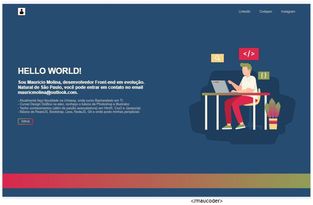
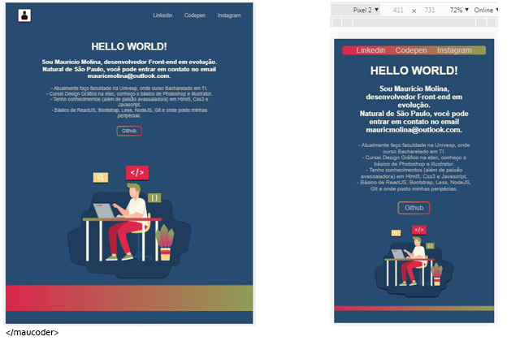

# Site simples - Responsivo e Semântico

# Versão Responsivo e no celular

- Feito apenas com HTML e CSS.
- É uma página única para portfolio.
- O desenho do programador usado no site foi modificado. É baixado do site [Freepik](http://www.freepik.com)
